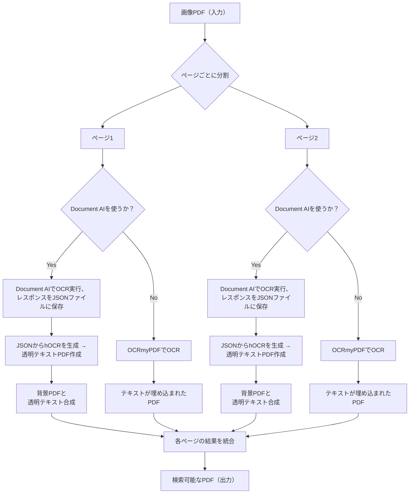

## convert-searcheble-pdf-sample
画像PDFを検索可能なPDFに変換する

### 前提
- uvをインストール済み
- Google Cloud SDKが使える状態であること
- Document AIにて、OCRプロセッサを作成済み
- ocrmypdfを導入済み

### 使用方法
変換させたい入力PDFファイルの名前、出力結果のPDFの名前を指定。
use_docaiオプションを`true`にすることで、Document AIによるOCRが行われる。
`False`にする場合は、OCRmyPDFによるOCRが行われ、PDF変換される。

```zsh
$ uv run convert_to_searchable_pdf_v2.py [input.pdf] [output.pdf] [use_docai]
```



### テストの実行
依存関係をインストール後、以下のコマンドでテストを実行できます。

```bash
$ pytest
```

